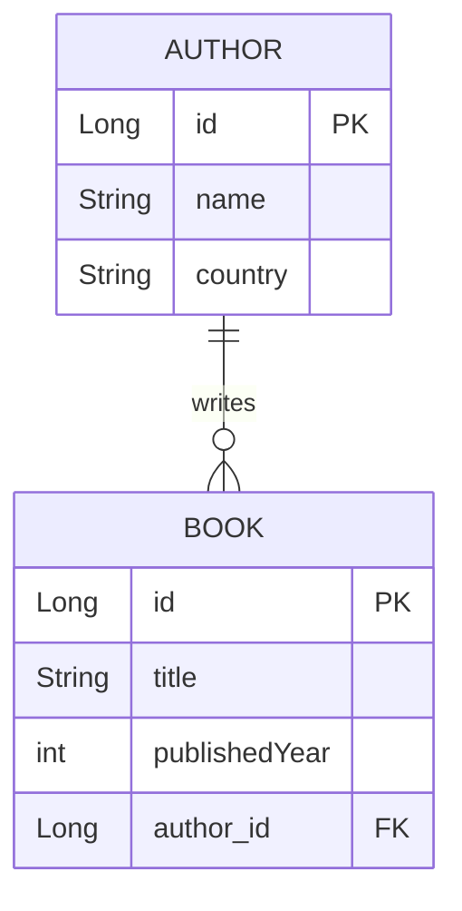
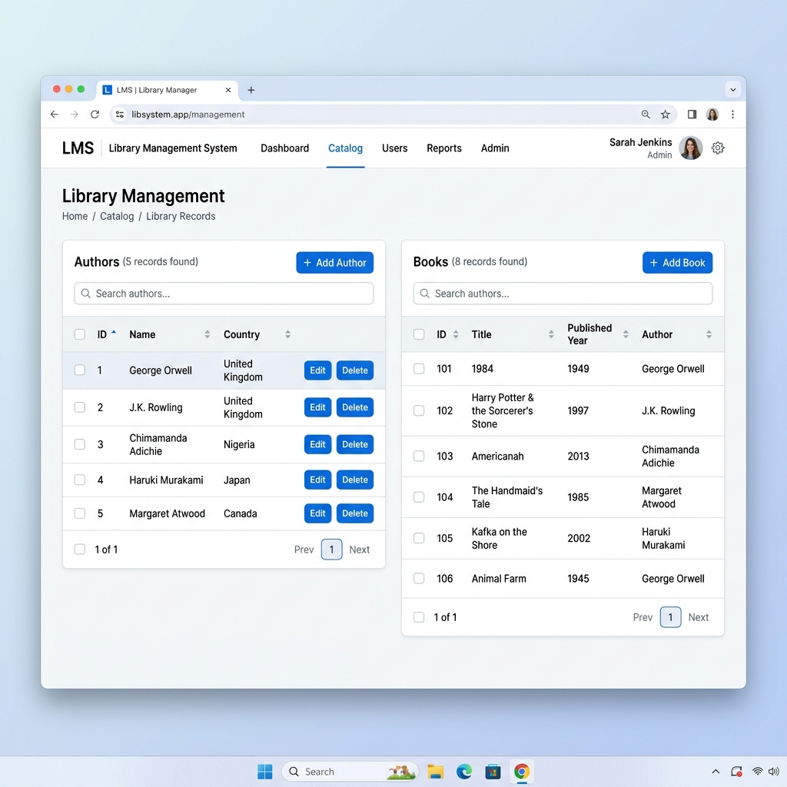
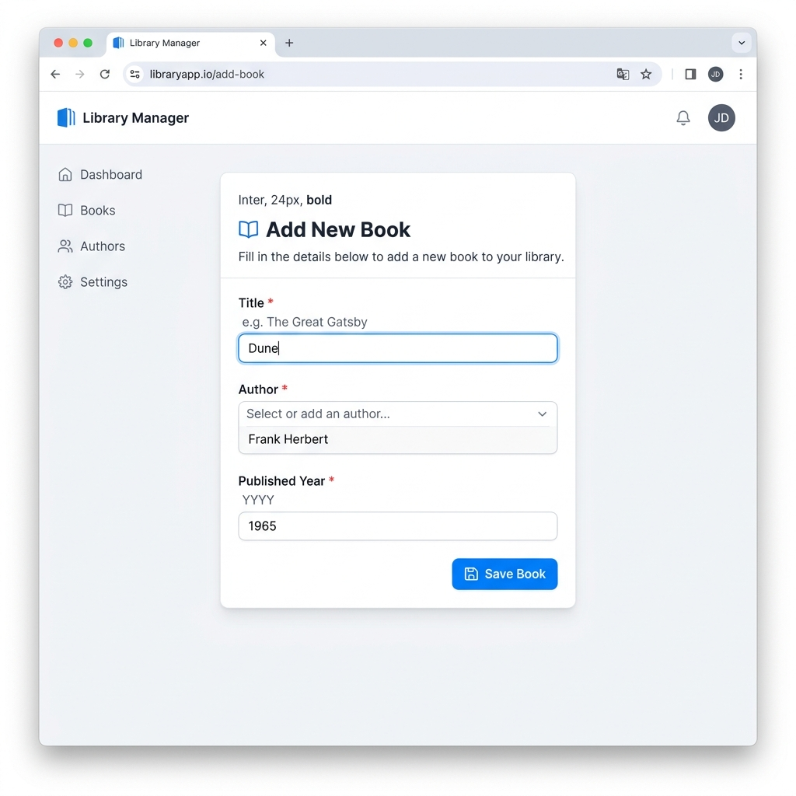

# DataNest - Spring Boot Library Management Application

Welcome to the **DataNest Library Management System**. This project is a Spring Boot application that demonstrates core web development concepts by managing two associated entities: **Authors** and **Books**. It provides a complete web interface for creating, reading, and updating data seamlessly.

---

## 1. Approach & Entity Relationship Design

### Entities Chosen
We have chosen the **Library Domain** as the core use case for this application. It effectively demonstrates real-world relational models.
- **`Author`**: Represents an individual who writes books.
- **`Book`**: Represents a published piece of work authored by a specific person.

### Entity Relationship Diagram
The system uses a **One-To-Many** relationship. One Author can write multiple Books, and each Book is mapped to exactly one Author.



### JPA Modeling & Constraints
- **Primary Keys**: Used `@Id` and `@GeneratedValue(strategy = GenerationType.IDENTITY)` for automatic ID generation.
- **Foreign Key constraint**: Configured using `@ManyToOne` and `@JoinColumn(name = "author_id")` within the `Book` entity.
- **Cascading**: Implemented `CascadeType.ALL` in the `Author` entity's `@OneToMany` mapping to efficiently manage nested saves and deletions.

---

## 2. Implementation Details

### Database Population
We initialized an embedded **H2 Database** configured via `application.properties`. To ensure the application starts with sample data, we used Spring's `CommandLineRunner` interface.
```java
@Component
public class DataLoader implements CommandLineRunner {
    @Override
    public void run(String... args) throws Exception {
        if (authorRepository.count() == 0) {
            Author author1 = new Author("J.K. Rowling", "UK");
            authorRepository.save(author1);
            
            Book book1 = new Book("Harry Potter", 1997, author1);
            bookRepository.save(book1);
            // ... more sample data
        }
    }
}
```

### Create Operation
The UI uses a JSP page (`add-book.jsp`) with a standard HTML form. Data is processed in the `LibraryController` with a `@PostMapping`.
Exceptions, such as `DataIntegrityViolationException`, are caught to present clean error messages directly in the UI instead of returning 500 server errors.

```java
@PostMapping("/saveBook")
public String saveBook(@ModelAttribute("book") Book book, Model model) {
    try {
        libraryService.saveBook(book);
        return "redirect:/";
    } catch (DataIntegrityViolationException e) {
        model.addAttribute("error", "Error: Integrity violation.");
        model.addAttribute("authors", libraryService.getAllAuthors());
        return "add-book";
    }
}
```

### Read Operation & Custom Inner Join
Data is fetched and passed to the `list.jsp` via the `LibraryService`. Specifically for the `Book` entity, we implemented a custom JPQL query performing an **inner join** to eagerly fetch the associated author.

```java
@Repository
public interface BookRepository extends JpaRepository<Book, Long> {
    // Custom query method performing an inner join
    @Query("SELECT b FROM Book b JOIN b.author a")
    List<Book> findAllBooksWithAuthors();
}
```

### Update Operation
A click on the *Edit* button routes the user to `/updateBook/{id}`. We pre-populate the entity by fetching it from the database and passing it via the Model context. The form then posts the updated entity back to the save method, dynamically detecting it as an update because the primary key (`id`) is already populated.

---

## 3. Application Screenshots

### Home Page (List View)
Here is the main dashboard showing all associated entities clearly rendered from the database:


### Add Book Form
Here is the clean interface where users can seamlessly add or update book metadata and assign it to existing authors:


---

## 4. Challenges Faced & Solutions

1. **JSP Configuration with Spring Boot**: Spring Boot favors Thymeleaf over JSP. To use JSP smoothly, we had to carefully specify the required dependencies (`tomcat-embed-jasper` and `jstl`) and adjust the `application.properties` to map `/WEB-INF/jsp/` views correctly.
2. **Entity Lazy Initialization**: In update scenarios, detaching and attaching entities with lazy relations occasionally caused initialization issues. We resolved this by relying on our explicit `JOIN` queries and properly setting the form context.
3. **Exception Handling for Constraints**: A direct entity save could throw internal 500 errors if it violates integrity constraints. We solved this by using extensive try-catch blocks over `DataIntegrityViolationException` to surface clean alerts to the end-user.

---

## 5. Running the Application Locally
1. Ensure Java 8+ and Maven are installed.
2. Clone this repository.
3. In the project root, run:
   ```bash
   mvn spring-boot:run
   ```
4. Access the web interface at: `http://localhost:8080/`

**GitHub URL:** [https://github.com/Monika-Bhardwaj/DataNest](https://github.com/Monika-Bhardwaj/DataNest)
